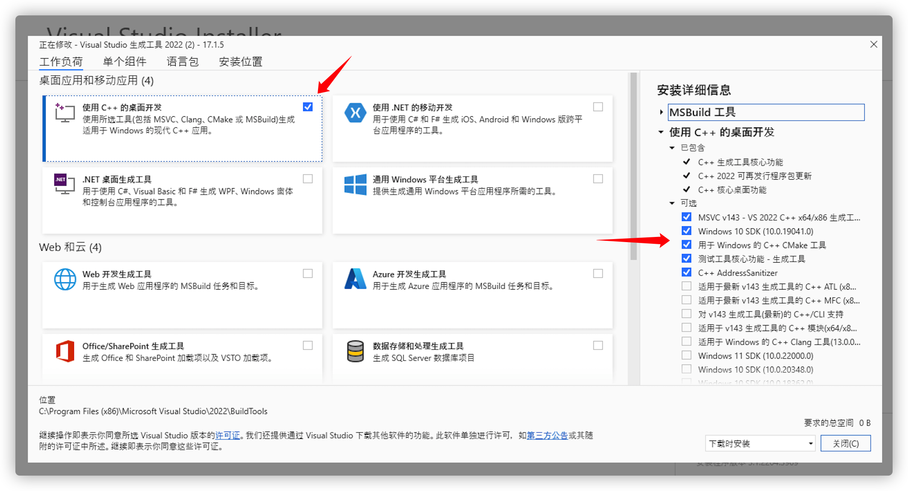
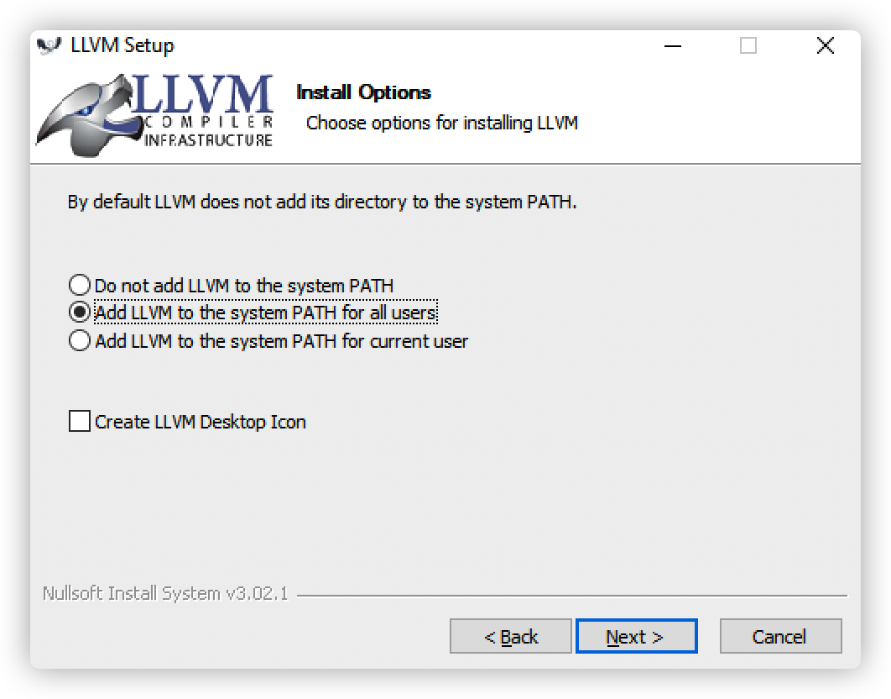
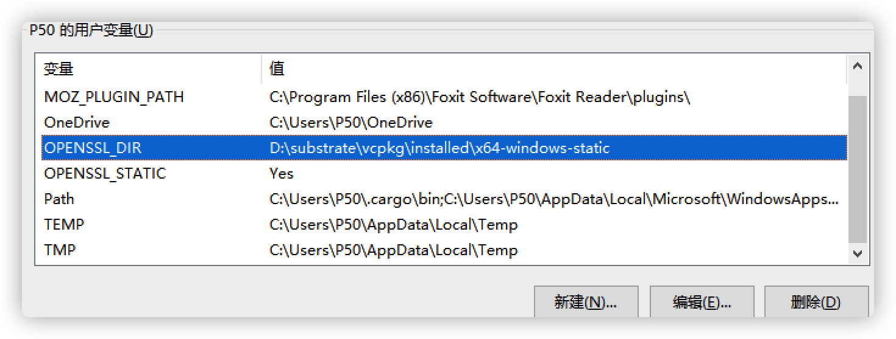
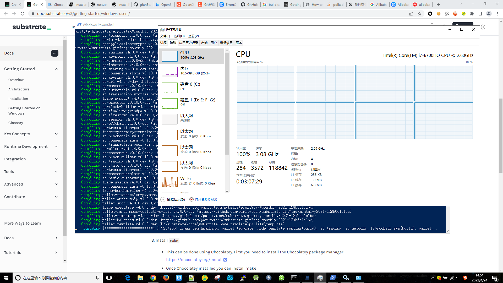
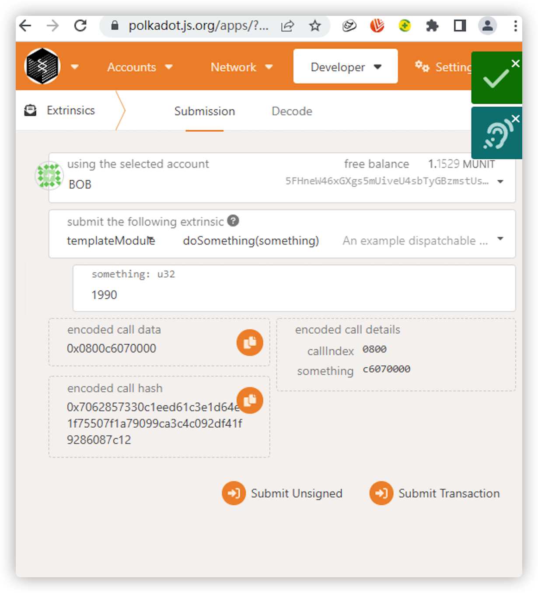

# 在Windows平台编译Substrate


本文将演示如何在Windows平台编译 [Substrate](https://substrate.io/) ，并运行 [substrate-node-template](https://github.com/substrate-developer-hub/substrate-node-template/tree/monthly-2021-12) 组成的一个私有网络。本次使用的 node-template 分支是 `tag：monthly-2021-12` 。 Windows操作系统用的Win10。 
 
### 安装依赖
参考：[docs.substrate.io](https://docs.substrate.io/) 提供的：[Getting Started on Windows](https://docs.substrate.io/v3/getting-started/windows-users/) 来安装依赖库。

1. 先下载安装 `vs_buildtools.exe`，到微软网站：https://aka.ms/buildtools 。 滚动页面到下面的 “All Downloads -- Build Tools for Visual Studio 2022 -- Build Tools for Visual Studio 2022”。找到并下载下来。

2. 安装 Visual C++ 编译工具，注意要选中 `Windows 10 SDK` ，笔者选的几个组件最重要的Win10 SDK，其他的clang，cmake都不需要安装，参考图片是：


3. 安装 `Rust` 工具链，这个是最简单的了。到 https://www.rust-lang.org/tools/install . 选择下载Windows的64位安装包。一切都默认安装，安装Rust过程中会提示你安装在那个目录，我们选 "1) Default Installation."，安装完成后，`%USERPROFILE%\.cargo\bin`  是rust Cargo的bin目录。安装完成后，可以关闭命令行，再重新重新打开，使得 `rustup`、`rustc`、`cargo` 命令能被新命令行终端找到。

4. 逐一运行

```
rustup update nightly

rustup update stable

rustup target add wasm32-unknown-unknown --toolchain nightly
```
安装完成后，执行
```
rustup show

Default host: x86_64-pc-windows-msvc
rustup home:  C:\Users\P50\.rustup

installed toolchains
--------------------

stable-x86_64-pc-windows-msvc (default)
nightly-x86_64-pc-windows-msvc

active toolchain
----------------

stable-x86_64-pc-windows-msvc (default)
rustc 1.60.0 (7737e0b5c 2022-04-04)
```
查看 rust 安装是否正确。


5. 从 https://releases.llvm.org/download.html 下载 LLVM，并安装，笔者从 [这里](https://github.com/llvm/llvm-project/releases/download/llvmorg-14.0.0/LLVM-14.0.0-win64.exe) 下载了`LLVM-14.0.0-win64.exe` 并安装，安装过程中 `把LLVM 命令加入到系统System的PATH环境变量中去，所有用户适用` ，其他步骤都是使用默认值，参考如图：

6. 安装 `Cmake`，从 https://cmake.org/download/ 下载适用于64位Windows的安装包，笔者使用的是[这个](https://github.com/Kitware/CMake/releases/download/v3.23.1/cmake-3.23.1-windows-x86_64.msi) ，同样的，安装过程中，也将它的命令行加入到系统的PATH环境变量里去。

7. 用 `vcpkg` 包管理工具来安装 `OpenSSL`。笔者在 `D` 盘建立了目录：`substrate`，用以保存一些下载和安装文件，执行以下操作：
```
mkdir D:\substrate
cd D:\substrate
git clone https://github.com/Microsoft/vcpkg.git --depth=1
cd vcpkg
.\bootstrap-vcpkg.bat
.\vcpkg.exe install openssl:x64-windows-static
```

这里用到了 `git`，所以，事先请先安装好 `git`。在 `git clone` 过程中遇到了些问题

```unable to access 'https://github.com/Microsoft/vcpkg.git/': OpenSSL SSL_read: Connection was aborted, errno 10053```，

经过搜索，更改2个git的配置解决:
```
git config --global http.sslVerify "false"
git config --global http.postBuffer 524288000
```

安装 `openssl` 的日志如下，这里把日志贴出来，是想让大家有一个全局的认识，大概会下载哪些软件包
```
D:\substrate>git clone https://github.com/Microsoft/vcpkg.git --depth=1
Cloning into 'vcpkg'...
fatal: unable to access 'https://github.com/Microsoft/vcpkg.git/': OpenSSL SSL_read: Connection was aborted, errno 10053

D:\substrate>git config --global http.sslVerify "false"

D:\substrate>git clone https://github.com/Microsoft/vcpkg.git --depth=1
Cloning into 'vcpkg'...
fatal: unable to access 'https://github.com/Microsoft/vcpkg.git/': Failed to connect to github.com port 443 after 21043 ms: Timed out

D:\substrate>git config --global http.postBuffer 524288000

D:\substrate>git clone https://github.com/Microsoft/vcpkg.git --depth=1
Cloning into 'vcpkg'...
remote: Enumerating objects: 10732, done.
remote: Counting objects: 100% (10732/10732), done.
remote: Compressing objects: 100% (9528/9528), done.
remote: Total 10732 (delta 2314), reused 6860 (delta 1149), pack-reused 0
Receiving objects: 100% (10732/10732), 4.71 MiB | 5.38 MiB/s, done.
Resolving deltas: 100% (2314/2314), done.
Updating files: 100% (8780/8780), done.

D:\substrate>cd vcpkg

D:\substrate\vcpkg>.\bootstrap-vcpkg.bat
Downloading https://github.com/microsoft/vcpkg-tool/releases/download/2022-03-30/vcpkg.exe -> D:\substrate\vcpkg\vcpkg.exe... done.
Validating signature... done.

Telemetry
---------
vcpkg collects usage data in order to help us improve your experience.
The data collected by Microsoft is anonymous.
You can opt-out of telemetry by re-running the bootstrap-vcpkg script with -disableMetrics,
passing --disable-metrics to vcpkg on the command line,
or by setting the VCPKG_DISABLE_METRICS environment variable.

Read more about vcpkg telemetry at docs/about/privacy.md

D:\substrate\vcpkg>
D:\substrate\vcpkg>.\vcpkg.exe install openssl:x64-windows-static
Computing installation plan...
The following packages will be built and installed:
    openssl[core]:x64-windows-static -> 3.0.2#3
  * vcpkg-cmake[core]:x64-windows -> 2022-04-12
  * vcpkg-cmake-config[core]:x64-windows -> 2022-02-06
Additional packages (*) will be modified to complete this operation.
Detecting compiler hash for triplet x64-windows...
-- Automatically setting HTTP(S)_PROXY environment variables to 127.0.0.1:7890
A suitable version of powershell-core was not found (required v7.2.1). Downloading portable powershell-core v7.2.1...
Downloading powershell-core...
  https://github.com/PowerShell/PowerShell/releases/download/v7.2.1/PowerShell-7.2.1-win-x86.zip -> D:\substrate\vcpkg\downloads\PowerShell-7.2.1-win-x86.zip
Extracting powershell-core...
Detecting compiler hash for triplet x64-windows-static...
Restored 0 packages from C:\Users\P50\AppData\Local\vcpkg\archives in 593 us. Use --debug to see more details.
Starting package 1/3: vcpkg-cmake:x64-windows
Building package vcpkg-cmake[core]:x64-windows...
-- Installing: D:/substrate/vcpkg/packages/vcpkg-cmake_x64-windows/share/vcpkg-cmake/vcpkg_cmake_configure.cmake
-- Installing: D:/substrate/vcpkg/packages/vcpkg-cmake_x64-windows/share/vcpkg-cmake/vcpkg_cmake_build.cmake
-- Installing: D:/substrate/vcpkg/packages/vcpkg-cmake_x64-windows/share/vcpkg-cmake/vcpkg_cmake_install.cmake
-- Installing: D:/substrate/vcpkg/packages/vcpkg-cmake_x64-windows/share/vcpkg-cmake/vcpkg_cmake_get_vars.cmake
-- Installing: D:/substrate/vcpkg/packages/vcpkg-cmake_x64-windows/share/vcpkg-cmake/cmake_get_vars
-- Installing: D:/substrate/vcpkg/packages/vcpkg-cmake_x64-windows/share/vcpkg-cmake/cmake_get_vars/CMakeLists.txt
-- Installing: D:/substrate/vcpkg/packages/vcpkg-cmake_x64-windows/share/vcpkg-cmake/vcpkg-port-config.cmake
-- Installing: D:/substrate/vcpkg/packages/vcpkg-cmake_x64-windows/share/vcpkg-cmake/copyright
-- Performing post-build validation
-- Performing post-build validation done
A suitable version of 7zip was not found (required v21.7.0). Downloading portable 7zip v21.7.0...
Downloading 7zip...
  https://www.7-zip.org/a/7z2107-extra.7z -> D:\substrate\vcpkg\downloads\7z2107-extra.7z
Extracting 7zip...
Stored binary cache: C:\Users\P50\AppData\Local\vcpkg\archives\8c\8c7a5bca23025f0ffda597bf6bff785de6c8022b1e24579a3d6c3104087d38fa.zip
Installing package vcpkg-cmake[core]:x64-windows...
Elapsed time for package vcpkg-cmake:x64-windows: 3.657 s
Starting package 2/3: vcpkg-cmake-config:x64-windows
Building package vcpkg-cmake-config[core]:x64-windows...
-- Installing: D:/substrate/vcpkg/packages/vcpkg-cmake-config_x64-windows/share/vcpkg-cmake-config/vcpkg_cmake_config_fixup.cmake
-- Installing: D:/substrate/vcpkg/packages/vcpkg-cmake-config_x64-windows/share/vcpkg-cmake-config/vcpkg-port-config.cmake
-- Installing: D:/substrate/vcpkg/packages/vcpkg-cmake-config_x64-windows/share/vcpkg-cmake-config/copyright
-- Performing post-build validation
-- Performing post-build validation done
Stored binary cache: C:\Users\P50\AppData\Local\vcpkg\archives\8e\8ea0e50473e118edcdf90ff84fd540a4688c121b0997176471bf30788a187313.zip
Installing package vcpkg-cmake-config[core]:x64-windows...
Elapsed time for package vcpkg-cmake-config:x64-windows: 720.4 ms
Starting package 3/3: openssl:x64-windows-static
Building package openssl[core]:x64-windows-static...
-- Downloading https://www.openssl.org/source/openssl-3.0.2.tar.gz -> openssl-3.0.2.tar.gz...
-- Downloading https://strawberryperl.com/download/5.32.1.1/strawberry-perl-5.32.1.1-32bit.zip -> strawberry-perl-5.32.1.1-32bit.zip...
-- Extracting source D:/substrate/vcpkg/downloads/openssl-3.0.2.tar.gz
-- Using source at D:/substrate/vcpkg/buildtrees/openssl/src/openssl-3-67d457a95e.clean
-- Downloading https://www.nasm.us/pub/nasm/releasebuilds/2.15.05/win32/nasm-2.15.05-win32.zip;https://fossies.org/windows/misc/nasm-2.15.05-win32.zip -> nasm-2.15.05-win32.zip...
-- Downloading https://download.qt.io/official_releases/jom/jom_1_1_3.zip;https://mirrors.ocf.berkeley.edu/qt/official_releases/jom/jom_1_1_3.zip -> jom_1_1_3.zip...
-- Copying openssl release source files...
-- Copying openssl release source files... done
-- Configure x64-windows-static-rel
-- Configure x64-windows-static-rel done
-- Build x64-windows-static-rel
-- Build x64-windows-static-rel done
-- Copying openssl debug source files...
-- Copying openssl debug source files... done
-- Configure x64-windows-static-dbg
-- Configure x64-windows-static-dbg done
-- Build x64-windows-static-dbg
-- Build x64-windows-static-dbg done
-- Installing: D:/substrate/vcpkg/packages/openssl_x64-windows-static/share/openssl/copyright
-- Fixing pkgconfig file: D:/substrate/vcpkg/packages/openssl_x64-windows-static/lib/pkgconfig/libcrypto.pc
-- Fixing pkgconfig file: D:/substrate/vcpkg/packages/openssl_x64-windows-static/lib/pkgconfig/libssl.pc
-- Fixing pkgconfig file: D:/substrate/vcpkg/packages/openssl_x64-windows-static/lib/pkgconfig/openssl.pc
-- Downloading https://repo.msys2.org/mingw/i686/mingw-w64-i686-pkg-config-0.29.2-3-any.pkg.tar.zst;https://www2.futureware.at/~nickoe/msys2-mirror/mingw/i686/mingw-w64-i686-pkg-config-0.29.2-3-any.pkg.tar.zst;https://mirror.yandex.ru/mirrors/msys2/mingw/i686/mingw-w64-i686-pkg-config-0.29.2-3-any.pkg.tar.zst;https://mirrors.tuna.tsinghua.edu.cn/msys2/mingw/i686/mingw-w64-i686-pkg-config-0.29.2-3-any.pkg.tar.zst;https://mirrors.ustc.edu.cn/msys2/mingw/i686/mingw-w64-i686-pkg-config-0.29.2-3-any.pkg.tar.zst;https://mirror.bit.edu.cn/msys2/mingw/i686/mingw-w64-i686-pkg-config-0.29.2-3-any.pkg.tar.zst;https://mirror.selfnet.de/msys2/mingw/i686/mingw-w64-i686-pkg-config-0.29.2-3-any.pkg.tar.zst;https://mirrors.sjtug.sjtu.edu.cn/msys2/mingw/i686/mingw-w64-i686-pkg-config-0.29.2-3-any.pkg.tar.zst -> msys-mingw-w64-i686-pkg-config-0.29.2-3-any.pkg.tar.zst...
-- Downloading https://repo.msys2.org/mingw/i686/mingw-w64-i686-libwinpthread-git-9.0.0.6373.5be8fcd83-1-any.pkg.tar.zst;https://www2.futureware.at/~nickoe/msys2-mirror/mingw/i686/mingw-w64-i686-libwinpthread-git-9.0.0.6373.5be8fcd83-1-any.pkg.tar.zst;https://mirror.yandex.ru/mirrors/msys2/mingw/i686/mingw-w64-i686-libwinpthread-git-9.0.0.6373.5be8fcd83-1-any.pkg.tar.zst;https://mirrors.tuna.tsinghua.edu.cn/msys2/mingw/i686/mingw-w64-i686-libwinpthread-git-9.0.0.6373.5be8fcd83-1-any.pkg.tar.zst;https://mirrors.ustc.edu.cn/msys2/mingw/i686/mingw-w64-i686-libwinpthread-git-9.0.0.6373.5be8fcd83-1-any.pkg.tar.zst;https://mirror.bit.edu.cn/msys2/mingw/i686/mingw-w64-i686-libwinpthread-git-9.0.0.6373.5be8fcd83-1-any.pkg.tar.zst;https://mirror.selfnet.de/msys2/mingw/i686/mingw-w64-i686-libwinpthread-git-9.0.0.6373.5be8fcd83-1-any.pkg.tar.zst;https://mirrors.sjtug.sjtu.edu.cn/msys2/mingw/i686/mingw-w64-i686-libwinpthread-git-9.0.0.6373.5be8fcd83-1-any.pkg.tar.zst -> msys-mingw-w64-i686-libwinpthread-git-9.0.0.6373.5be8fcd83-1-any.pkg.tar.zst...
-- Using msys root at D:/substrate/vcpkg/downloads/tools/msys2/9a1ec3f33446b195
-- Fixing pkgconfig file: D:/substrate/vcpkg/packages/openssl_x64-windows-static/debug/lib/pkgconfig/libcrypto.pc
-- Fixing pkgconfig file: D:/substrate/vcpkg/packages/openssl_x64-windows-static/debug/lib/pkgconfig/libssl.pc
-- Fixing pkgconfig file: D:/substrate/vcpkg/packages/openssl_x64-windows-static/debug/lib/pkgconfig/openssl.pc
-- Installing: D:/substrate/vcpkg/packages/openssl_x64-windows-static/share/openssl/usage
-- Performing post-build validation
-- Performing post-build validation done
Stored binary cache: C:\Users\P50\AppData\Local\vcpkg\archives\aa\aa226768e08381cb9aa1e1392c1a03e6734dc629183ba651ae23328d3cf8f49b.zip
Installing package openssl[core]:x64-windows-static...
Elapsed time for package openssl:x64-windows-static: 32.46 min

Total elapsed time: 33.29 min

The package openssl is compatible with built-in CMake targets:

    find_package(OpenSSL REQUIRED)
    target_link_libraries(main PRIVATE OpenSSL::SSL OpenSSL::Crypto)


D:\substrate\vcpkg>
```
至此，openssl安装完成，`vcpkg` 这个目录里的内容是 `portable` 的，可以 `zip` 压缩后，拷贝到其他电脑解开来使用，免去再次下载的烦恼。

后续配置 `openssl` 的环境变量：
```
$env:OPENSSL_DIR = 'D:\substrate\vcpkg\installed\x64-windows-static'
$env:OPENSSL_STATIC = 'Yes'
[System.Environment]::SetEnvironmentVariable('OPENSSL_DIR', $env:OPENSSL_DIR, [System.EnvironmentVariableTarget]::User)
[System.Environment]::SetEnvironmentVariable('OPENSSL_STATIC', $env:OPENSSL_STATIC, [System.EnvironmentVariableTarget]::User)
```
以管理员权限运行 `powershell` 命令行终端，在终端中执行以上命令。

等同的效果是在Windows的环境变量中添加2个变量：



8. 安装 `make` , 使用 `Chocolatey` 包管理工具来安装，从 [https://chocolatey.org/install](https://chocolatey.org/install)  找到powershell脚本:
```
Set-ExecutionPolicy Bypass -Scope Process -Force; [System.Net.ServicePointManager]::SecurityProtocol = [System.Net.ServicePointManager]::SecurityProtocol -bor 3072; iex ((New-Object System.Net.WebClient).DownloadString('https://community.chocolatey.org/install.ps1'))
```

安装 `make` 的日志如下:
```
PS C:\Windows\system32> choco install make
Chocolatey v1.1.0
Installing the following packages:
make
By installing, you accept licenses for the packages.
Progress: Downloading make 4.3... 100%

make v4.3 [Approved]
make package files install completed. Performing other installation steps.
 ShimGen has successfully created a shim for make.exe
 The install of make was successful.
  Software installed to 'C:\ProgramData\chocolatey\lib\make'

Chocolatey installed 1/1 packages.
 See the log for details (C:\ProgramData\chocolatey\logs\chocolatey.log).
```

9. 总结下来，我们需要安装的组件是：
* vs_build_tool，主要是Win10SDK
* Rust，包括nightly版本和wasm32支持
* 安装LLVM。这是通过独立安装包进行的，
* 安装cmake。这是通过独立安装包进行的，
* 安装openssl，这是通过vcpkg来安装的，并配置openssl。
* 安装make，这是通过Chocolatey来安装的。

整个过程持续了几个小时，主要是包下载不方便，有时需要·欢个强·。

### 编译代码
安装完后，把  `substrate-node-template` 代码拿下来编译，这里笔者使用的是 `monthly-2021-12` 版本
```
git clone -b monthly-2021-12 https://github.com/substrate-developer-hub/substrate-node-template.git --depth=1
```
在进入项目目录里，编译的命令是：
```
cd substrate-node-template
cargo build --release
```

编译的时候，记得把 `360杀毒` 或者`360卫士`关闭，免得误报为病毒。笔者就是因为360的胡乱阻止，导致编译失败，
```
   Compiling hash256-std-hasher v0.15.2
   Compiling rand_core v0.5.1
   Compiling idna v0.2.3
error: failed to run custom build command for `lz4-sys v1.9.2`

Caused by:
  could not execute process `D:\substrate\code\substrate-node-template\target\release\build\lz4-sys-981e798c37cd4f2d\build-script-build` (never executed)

Caused by:
  拒绝访问。 (os error 5)
warning: build failed, waiting for other jobs to finish...
error: build failed
```
比如上面问题，因为360把某些文件当做病毒，拒绝写入导致编译失败，当把360杀毒和卫士都关闭后，继续重新编译。最后在机器的轰鸣声中成功完成编译。


看见这个美妙的`Finished`，总不枉费一番折腾！可以看看编译的时候的CPU都拉到100%！




# 在Windows平台运行Substrate

编译完成后，笔者运行：
```
.\target\release\node-template.exe --dev --tmp
```
来运行一个本地节点，然后通过 https://polkadot.js.org/apps 来访问本地的 `ws://127.0.0.1:9944` 节点，通过界面来对`TemplateModule.doSomething`进行一个`Extrinsics`操作，如下图，可以看到执行成功



我们检查Windows下编译输出的Wasm文件大小，与在Mac下编译出来的Wasm大小对比，发现是差不多的。

```
 dir .\target\release\wbuild\node-template-runtime\
  目录: D:\substrate\code\substrate-node-template\target\release\wbuild\node-template-runtime
Mode                LastWriteTime         Length Name
----                -------------         ------ ----
d-----        2022/4/24     14:49                src
d-----        2022/4/24     14:55                target
-a----        2022/4/24     14:49          43778 Cargo.lock
-a----        2022/4/24     14:49            393 Cargo.toml
-a----        2022/4/24     14:55         131980 node_template_runtime.compact.compressed.wasm
-a----        2022/4/24     14:55         479612 node_template_runtime.compact.wasm
-a----        2022/4/24     14:55         640503 node_template_runtime.wasm
```
这个 `release\wbuild\node-template-runtime\` 目录下的wasm文件，就是区块链`Runtime`的核心可执行代码，当进行链上治理升级的时候，就是把这个wasm文件上传到链上，然后各个节点同步该数据。这个也是`Substrate`与众不同的链上无分叉升级的核心所在。


# 在两台电脑之间构建私有的Substrate网络

在Windows平台编译成功后，笔者再在Mac电脑上编译一份相同代码版本的`substrate-node-template`程序，得到一个可执行程序，现在笔者将Windows平台的exe与Mac平台的可执行程序一起组成一个2个节点的私有网络。参考 [Start a private network](https://docs.substrate.io/tutorials/v3/private-network/)。

笔者本地的Windows电脑的IP地址是`192.168.0.101`，Mac电脑的IP地址是`192.168.0.100`。

1. 首先，生成2个新账户，作为运行链时的出块和固化(finalize)块的账号。生成账号使用`subkey`，可以参考[Subkey](https://docs.substrate.io/v3/tools/subkey/) 来单独安装该命令。安装完成后，我们执行 `subkey generate --scheme sr25519` 来生成 `auro` 的key，用 `subkey inspect --scheme ed25519 "..助记词..."` 来解析一个助记词生成 `grandpa` 的key

```
# 第一组key生成

# 这个key是auro使用的，
# 出块使用，填入到chain-spec中，使用的是SS58格式的公钥地址。
# hex格式的Public key (hex)公钥地址用于 curl 做RPC调用插入到运行节点
$ subkey generate --scheme sr25519
Secret phrase:       behave seat jewel opera timber post pulp open match erase high chicken
  Secret seed:       0x2521ed118858a28d48620b207a0dd410a412358e1010c862993ab67ccd9ed34d
  Public key (hex):  0x560d8ff12dc3ce7598dcca1a62af47d24a0970b5d3edc92ccfedeb66796d3128
  Account ID:        0x560d8ff12dc3ce7598dcca1a62af47d24a0970b5d3edc92ccfedeb66796d3128
  Public key (SS58): 5E1Y1Bz5GJKB2HA2y2SL5k5Rw3ULgRcD55TbuxtGKTfSKN7c
  SS58 Address:      5E1Y1Bz5GJKB2HA2y2SL5k5Rw3ULgRcD55TbuxtGKTfSKN7c

# 这个key是grandpa使用，是固化块使用的，格式是 ed25519 ，它是直接使用的上一步的助记词，而非随机生成，它与之对应的aurokey是相同秘钥的
$ subkey inspect --scheme ed25519 "behave seat jewel opera timber post pulp open match erase high chicken"
Secret phrase:       behave seat jewel opera timber post pulp open match erase high chicken
  Secret seed:       0x2521ed118858a28d48620b207a0dd410a412358e1010c862993ab67ccd9ed34d
  Public key (hex):  0x8c07921a702eb6343ab86aa7d4451f7897332d88b47102e6d9cbb29473132fad
  Account ID:        0x8c07921a702eb6343ab86aa7d4451f7897332d88b47102e6d9cbb29473132fad
  Public key (SS58): 5FEJow4hfotPWBAxbEzXpzRmw9rDjaqHLLk11Dq2pBEdutpX
  SS58 Address:      5FEJow4hfotPWBAxbEzXpzRmw9rDjaqHLLk11Dq2pBEdutpX


# 第二组key生成，同理

$ subkey generate --scheme sr25519
Secret phrase:       they diet rebuild candy buzz purchase barely smoke small away fitness avoid
  Secret seed:       0x860a40d6cd6a5d9cac8133949f357f938ccaee2a6465c356008bf30d62d0ac99
  Public key (hex):  0x36e9bdfc738e47fa37dae1bd6a2c533c9ca8445baa3b3c69b8c8182c5f79ac0d
  Account ID:        0x36e9bdfc738e47fa37dae1bd6a2c533c9ca8445baa3b3c69b8c8182c5f79ac0d
  Public key (SS58): 5DJhsviAGCKy6aZKKgNkkQnxZAtn8KifhtT3JaSvCvZNwvWq
  SS58 Address:      5DJhsviAGCKy6aZKKgNkkQnxZAtn8KifhtT3JaSvCvZNwvWq

$ subkey inspect --scheme ed25519 "they diet rebuild candy buzz purchase barely smoke small away fitness avoid"
Secret phrase:       they diet rebuild candy buzz purchase barely smoke small away fitness avoid
  Secret seed:       0x860a40d6cd6a5d9cac8133949f357f938ccaee2a6465c356008bf30d62d0ac99
  Public key (hex):  0x79d4b39b542337ce2274f0383f3514f94704b27d66d25b3643ab4db29917d34e
  Account ID:        0x79d4b39b542337ce2274f0383f3514f94704b27d66d25b3643ab4db29917d34e
  Public key (SS58): 5EpSqVBPxzAP7R4ju3B8Ym27eGGKNy1uGv7dMVkDGPv4yCoa
  SS58 Address:      5EpSqVBPxzAP7R4ju3B8Ym27eGGKNy1uGv7dMVkDGPv4yCoa
```

两组四个Key生成完成后备用，这里一定要区分清楚 `sr25519` 和 `ed25519` 的不同key，不要混淆。


2. 接下来，生成 `chain spec文件`，chain-spec文件的信息来源由代码中定义的`local`这个spec修改而来。所以我们生成命令中来源定义为`local`。代码中已经hardcode一个测试用的`local`的信息，该 `local` 使用的账号是 `Alice` 和 `Bob` ，这里改为由上面生成的2个key作为账号。`chain spec`主要的作用就是在`Pallet`初始化时给构造函数传入各种参数。
```
 D:\...\target\release> .\node-template.exe build-spec --disable-default-bootnode --chain local > local.json
2022-04-24 18:51:44 Building chain spec
```
生成成功。我们需要修改`aura`和`grandpa`这2个`Pallet`的账号信息。
```
{
  "name": "Local Testnet",
  "id": "local_testnet",
  "chainType": "Local",
  "bootNodes": [],
  "telemetryEndpoints": null,
  "protocolId": null,
  "properties": null,
  "consensusEngine": null,
  "codeSubstitutes": {},
  "genesis": {
    "runtime": {
      "system": {
          // 这里省略了wasm的code，但请你不要修改它，大片字符不方便展示才删除，只需要改 aura 和 grandpa 节点里的key
        "code": "0x52bc5........"  
      },
      "aura": {
        "authorities": [
            // 这是需要修改的账号，代码里hardcode的是Alice和Bob，这里已经改为自己生成的 sr25519 格式的 SS58 公钥账号
            // 本示例是2个节点的网络，这里需要2个账号，这里的账号用于产生区块
          "5E1Y1Bz5GJKB2HA2y2SL5k5Rw3ULgRcD55TbuxtGKTfSKN7c",   
          "5DJhsviAGCKy6aZKKgNkkQnxZAtn8KifhtT3JaSvCvZNwvWq"    
        ]
      },
      "grandpa": {
        "authorities": [
          [
              // 这是需要修改的账号，代码里hardcode的是Alice和Bob，这里已经改为自己生成的 ed25519 格式的 SS58 公钥账号，
              // 账号与auro里的第一个对应，每个账号匹配对应，但格式不同。
              // 本示例是2个节点的网络，这里需要2个账号，这里的账号用于固化finalize区块。 另一个数值 1 是权重，表示这里2个账号权重一样
            "5FEJow4hfotPWBAxbEzXpzRmw9rDjaqHLLk11Dq2pBEdutpX", 
            1
          ],
          [
            "5EpSqVBPxzAP7R4ju3B8Ym27eGGKNy1uGv7dMVkDGPv4yCoa", 
            1                                                   
          ]
        ]
      },
      ......
```

修改完 `chain spec` 后，开始生成一个 `raw chain spec` ,如下：
```
D:\...\target\release> .\node-template.exe build-spec --disable-default-bootnode --chain=local.json --raw > local_raw.json
Error: Input("Error parsing spec file: expected value at line 1 column 1")
```
发现有报错，但相同的文件在Mac上执行成功，进过一番调查发现是文件编码不对，在Windows平台上用 `node-template.exe` 生成的 `local.json` 文件显示是 `UCS-2 LE BOM` 格式，它其实就是 `UTF-16 little endian` ，我们需要改为 `UTF-8` （这里是UTF-8，不是UTF-8-BOM，这里不带BOM的）。还有文件的结尾换行符，在windows平台上是 `CRLF` ，也可以改为 `LF` ，但这改不改似乎关系不大。生成出来的 `local_raw.json` 文件，我们依然要修改它的编码，记住，我们这里是放在Windows上生成这些文件的，这些文件随后会被分发给需要加入这条链的各个独立节点。具有相同文件的，即他们运行相同 `运行时runtime` ，他们才会是同一个网络。

将 `local_raw.json`和 `local.json`拷贝到Mac电脑上。 这里我们使用这个 `spec chain` 文件来启动节点，运行方式加上 `--execution wasm` , 那他们就是以这个json文件中的code来运行业务逻辑的。

3. Mac上启动节点：
```
./node-template \
--chain=local_raw.json \
--base-path ./macdata \
--name alice \
--node-key=213216127a8a8756f4017d2aaafa7e0054e9958e7ded5d5784c5e2f6f6365e0f \
--port 30333 \
--ws-port 9944 \
--rpc-port 9933 \
--validator \
--rpc-cors all \
--execution wasm \
--unsafe-rpc-external \
--unsafe-ws-external \
--rpc-methods=unsafe
```
这里临时数据放在 `./macdata` 目录。
启动日志如下：
```
2022-04-26 17:23:40 Substrate Node    
2022-04-26 17:23:40 ✌️  version 4.0.0-dev-7ce49b8-x86_64-macos    
2022-04-26 17:23:40 ❤️  by Substrate DevHub <https://github.com/substrate-developer-hub>, 2017-2022    
2022-04-26 17:23:40 📋 Chain specification: Local Testnet    
2022-04-26 17:23:40 🏷 Node name: alice    
2022-04-26 17:23:40 👤 Role: AUTHORITY    
2022-04-26 17:23:40 💾 Database: RocksDb at ./macdata/chains/local_testnet/db/full    
2022-04-26 17:23:40 ⛓  Native runtime: node-template-100 (node-template-1.tx1.au1)    
2022-04-26 17:23:40 🔨 Initializing Genesis block/state (state: 0x6985…dd83, header-hash: 0xee92…f150)    
2022-04-26 17:23:40 👴 Loading GRANDPA authority set from genesis on what appears to be first startup.    
2022-04-26 17:23:40 ⏱  Loaded block-time = 6s from block 0xee928edcca534c3567cd3e9e716a7ff970581c9d7f2a7c06b810fc32ee35f150    
2022-04-26 17:23:40 Using default protocol ID "sup" because none is configured in the chain specs    
2022-04-26 17:23:40 🏷 Local node identity is: 12D3KooWFzXtYJhUkMsWTXQodYaXhs6ah52xVExicuFPvmUQoZrE    
2022-04-26 17:23:41 📦 Highest known block at #0 
```


4. Windows上启动节点：
```
D:\substrate\...\target\release> ./node-template.exe --chain=local_raw.json --base-path ./windata --name bob --
node-key=a5564705d6b399a3673268fdf799e2c1d4d60547cf191c66b03e91e051b918ad --port 30333 --ws-port 9944 --rpc-port 9933 --validator --rpc-cor
s all --execution wasm --unsafe-rpc-external --unsafe-ws-external --rpc-methods=unsafe
```
这里临时数据放在 `./windata` 目录

节点启动后，如果能相互发现对方，则日志如下 
```
Idle (1 peers), best: #0 (0xd72d…1da7), finalized #0 (0xee92…f150), ⬇ 0.2kiB/s ⬆ 99 B/s 
```

如果有  `Idle (1 peers)`  ,表示2个节点已经链接。因为在局域网可以自动发现，如果无法发现，可以在Windows端的启动命令行后加上
```
--bootnodes /ip4/192.168.0.100/tcp/30333/p2p/12D3KooWFzXtYJhUkMsWTXQodYaXhs6ah52xVExicuFPvmUQoZrE
```
这表示，它会寻找对端作为启动节点，并加入网络。 这里的 `12D3...mUQoZrE` 来自Mac节点运行的日志输出的 `Local node identity` 。

节点启动后，他们还没有插入 key，无法完成出块和达到固化的共识。我们使用 `curl` 插入key，因为2台电脑在同一个局域网，能通信，我们直接在一台电脑上，向2个节点提交RPC数据

```
# 向 Windows节点插入auro的key，使用了助记词和使用sr25519编码的hex格式的Public key (hex)公钥地址用于 curl 做 RPC 调用向节点插入数据
curl http://192.168.0.101:9933 -H "Content-Type:application/json;charset=utf-8" -d \
               '{
                 "jsonrpc":"2.0",
                 "id":1,
                 "method":"author_insertKey",
                 "params": [
                   "aura",
      "behave seat jewel opera timber post pulp open match erase high chicken",
      "0x560d8ff12dc3ce7598dcca1a62af47d24a0970b5d3edc92ccfedeb66796d3128"
    ]
  }'

# 向 Windows节点插入grandpa的key，使用了助记词和使用ed25519编码的hex格式的Public key (hex)公钥地址用于 curl 做 RPC 调用向节点插入数据
curl http://192.168.0.101:9933 -H "Content-Type:application/json;charset=utf-8" -d \
               '{
                 "jsonrpc":"2.0",
                 "id":1,
                 "method":"author_insertKey",
                 "params": [
                   "gran",
      "behave seat jewel opera timber post pulp open match erase high chicken",
      "0x8c07921a702eb6343ab86aa7d4451f7897332d88b47102e6d9cbb29473132fad"
    ]
 }'

# 向Mac节点插入auro的key，使用了助记词和使用sr25519编码的hex格式的Public key (hex)公钥地址用于 curl 做 RPC 调用向节点插入数据
curl http://192.168.0.100:9933 -H "Content-Type:application/json;charset=utf-8" -d \
               '{
                 "jsonrpc":"2.0",
                 "id":1,
                 "method":"author_insertKey",
                 "params": [
                   "aura",
      "they diet rebuild candy buzz purchase barely smoke small away fitness avoid",
      "0x36e9bdfc738e47fa37dae1bd6a2c533c9ca8445baa3b3c69b8c8182c5f79ac0d"
    ]
  }'

# 向 Mac 节点插入grandpa 的key，使用了助记词和使用ed25519编码的hex格式的Public key (hex)公钥地址用于 curl 做 RPC 调用向节点插入数据
curl http://192.168.0.100:9933 -H "Content-Type:application/json;charset=utf-8" -d \
               '{
                 "jsonrpc":"2.0",
                 "id":1,
                 "method":"author_insertKey",
                 "params": [
                   "gran",
      "they diet rebuild candy buzz purchase barely smoke small away fitness avoid",
      "0x79d4b39b542337ce2274f0383f3514f94704b27d66d25b3643ab4db29917d34e"
    ]
  }'
```

执行后，如果每个命令返回 `{"jsonrpc":"2.0","result":null,"id":1}` 表示成功，这时，如果我们观察2个节点的日志，
```
Idle (1 peers), best: #1 (0xd72d…1da7), finalized #0 (0xee92…f150), ⬇ 0.2kiB/s ⬆ 99 B/s 
```
会发现各个节点已经相互链接，已经可以出块，但无法达到固化(finalize)区块的共识。我们 `Ctrl+C ` 终止程序，再使用相同的命令重新运行，等一会儿再观察，就会发现2个节点都能出块，也能达到固化区块的共识。
```
Idle (1 peers), best: #10 (0xfc8f…1874), finalized #8 (0xd7e9…2dd0), ⬇ 1.5kiB/s ⬆ 1.6kiB/s
```

到这里，大功告成。我们完成了演示 如何在windows上编译Substrate并用Windows程序组成一个私有的网络。如下图：


如果大家在自己尝试的过程中发现无法出块或无法固化区块，需要检查几个地方，
1. `chain-spec` 文件是否是同一份文件，如果使用 `local_raw.json` 一直无法出块，则可以使用 `local.json` 来试一试，或者从Mac端生成这2个文件，拷贝到Windows端，毕竟从Mac端生成就不需要改文件编码，有时候稍稍的小改动可能会导致2个节点无法组网。
2. 检查 `auro` 和 `grandpa` 的key对不对，很多情况下是这2个key不对导致的。停止程序运行，然后删除`windata` 和 `macdata` 2个目录，重新执行插入key的操作，这个过程中需要反复检查key是否正确。

大家可能有疑问，插入key后，为什么需要特别的重启程序才能达到固化区块的目的。这是因为[substrate-node-template](https://github.com/substrate-developer-hub/substrate-node-template/tree/monthly-2021-12)是一个极简区块链Demo，它还缺少一个 `Pallet` 来实现自动的key管理。有了这个Pallet，我们就不需要这么麻烦的使用`subkey`来生成key，也不需要执行繁琐的且容易出错的插入key操作。只需要鼠标轻轻点点就可以达到不需要重启就让链能出块和达到共识。后面有机会我们再来介绍这个神奇的`Pallet`吧！


